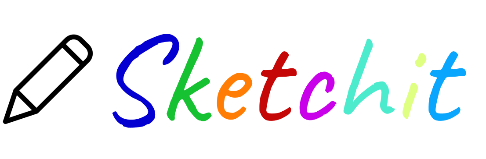

# Sketchit

Sketchit is not your ordinary game of pictionary. Invite your friends to play an exciting version of pictionary with powerups and debuffs like you've never seen before.

### Core Tecnologies

**Backend:** Ruby on Rails, Postgresql, ActionCable

**Frontend:** React, Redux, React Bootstrap

### Project Status

**Complete:** Lobby and drawing functionalities have been built. The app currenly functions as a live-sketchpad for users to draw together. 

**Next step:** Implementing ActionCable functionality for controlling the Game across multiple consumers.

# Resources

[Video Demo of Lobby and Drawing Features](https://youtu.be/cpu44Yd8lRQ)

[Blog about setting up ActionCable with React](https://jesse-gan.medium.com/drawing-together-in-real-time-with-action-cable-and-react-b5e620333a1a)

[Frontend Design Model](https://app.lucidchart.com/invitations/accept/38986539-db6e-4969-ae7f-29b20697a7b2)

# Installation and Set Up

## Prerequisites

Before you continue, ensure you have met the following requirements:

* You have installed the latest version of Ruby and Ruby on Rails
* You have a local PostgreSQL server
* You have installed the latest version of npm

## Installation

1. Download or clone repository
2. Install dependencies:
    * From backend directory, run `bundle install` in console
    * From frontend directory, run `npm install` in console
3. Setup Postgresql Server
    * In backend directory, create a `.env` file
    * Refer to [`database.yml`](backend/config/database.yml) file in the backend directory for which values to add to your `.env` file
    * Run `rails db:create` in console to ensure setup works
4. Run servers
    * From backend directory, run `rails s -p 8000` in console. If using a different port, please update `BASEURL` constants in `frontend/src/actions/*` files.
    * From frontend directory, run `npm start` in console
5. If app doesn't automatically open in your browser, go to `localhost:3000` to view the app

# Author

**Jesse Gan**
* Github: [@jessegan](https://github.com/jessegan)
* Medium: [@jesse.gan](https://medium.com/@jesse.gan)

# License

This project is [MIT](LICENSE) licensed.